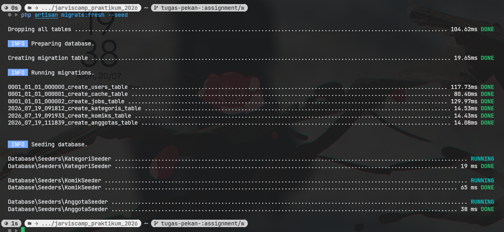
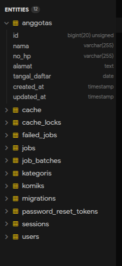
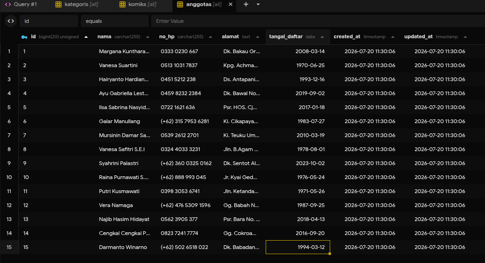

# Jarviscamp Praktikum 2026 - Web Developer

Repository ini berisi kumpulan tugas praktikum dan proyek dari bootcamp **Jarviscamp Web Developer 2026**. Proyek utama yang dibangun adalah aplikasi manajemen komik berbasis Laravel.

## Deskripsi Proyek

Proyek ini dibangun menggunakan framework Laravel dan akan terus berkembang seiring dengan materi bootcamp tiap minggunya. Beberapa fitur awal mencakup manajemen entitas seperti Kategori dan Komik.

## Persyaratan (Requirements)

- PHP >= 8.2
- Composer
- MySQL / MariaDB atau database lain yang didukung Laravel
- Node.js & NPM

## Cara Menjalankan Proyek Secara Lokal

Ikuti langkah-langkah berikut untuk menjalankan proyek ini di mesin lokal Anda:

1. **Clone repository ini**

    ```bash
    git clone https://github.com/Febrian1202/jarviscamp-praktikum-2026.git
    cd jarviscamp-praktikum-2026
    ```

2. **Install dependency PHP (Composer)**

    ```bash
    composer install
    ```

3. **Install dependency frontend (NPM)**

    ```bash
    npm install
    npm run build
    ```

4. **Siapkan Environment Variables**
   Salin file `.env.example` menjadi `.env`:

    ```bash
    cp .env.example .env
    ```

    Lalu buka file `.env` dan sesuaikan konfigurasi database (DB_DATABASE, DB_USERNAME, DB_PASSWORD).

5. **Generate Application Key**

    ```bash
    php artisan key:generate
    ```

6. **Jalankan Migrasi dan Seeder**
   Untuk membuat tabel database beserta data dummy (Kategori, Komik, dll):

    ```bash
    php artisan migrate:fresh --seed
    ```

7. **Jalankan Server Development**
    ```bash
    php artisan serve
    ```
    Aplikasi dapat diakses di `http://localhost:8000`.

## Progres Mingguan

- **Inisialisasi Awal**: Setup Laravel, model, migration, factory, dan seeder untuk `Kategori` dan `Komik`.
- _(Akan diupdate seiring berjalannya praktikum)_

## Dokumentasi & Hasil Tugas (Kriteria Penilaian)

Bagian ini berisi tangkapan layar (screenshot) sebagai bukti penyelesaian tugas mingguan.

### Week 2: Migration, Factory & Seeder (Tabel Anggota)

- **Hasil Artisan**
    <!-- Ganti link gambar di bawah dengan path gambar screenshot Anda -->
    
- **Hasil Migration:**
    <!-- Ganti link gambar di bawah dengan path gambar screenshot Anda -->

    

- **Hasil Database:**
    <!-- Ganti link gambar di bawah dengan path gambar screenshot Anda -->
    

## Lisensi

Proyek ini adalah bagian dari pembelajaran di Jarviscamp dan bersifat _open-source_ di bawah [Lisensi MIT](https://opensource.org/licenses/MIT).
